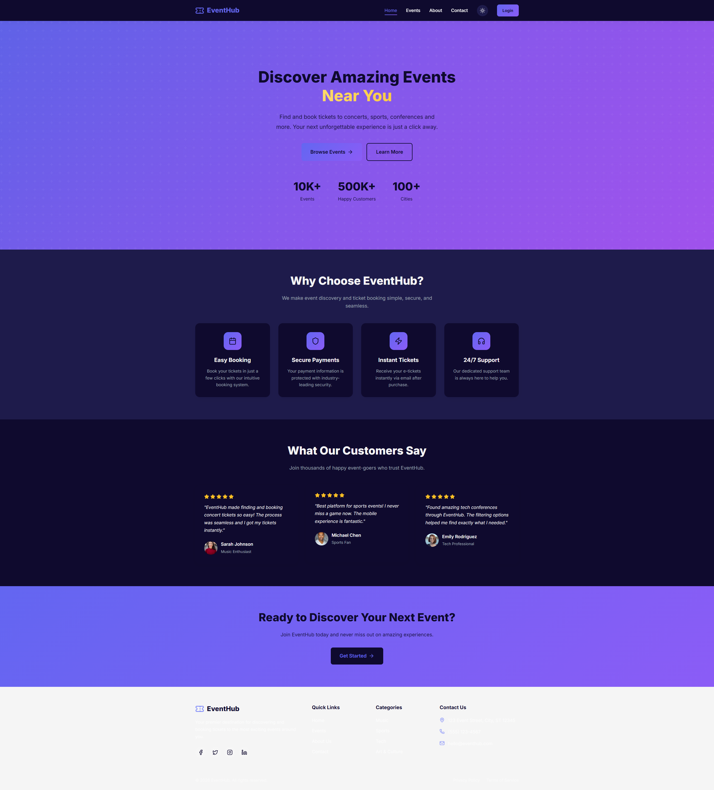

# Phase 2: Edit/Enhancement Capability Test

**Date:** June 23, 2026 | **By:** @Dheeraj  
**Objective:** Test how well each tool handles small feature updates/edits to an existing app

---

## 🏆 Winner: Kiro

Kiro completed the enhancement faster (~3 min) with no errors. Claude Code + Lovable MCP took longer (5-10 min) due to package errors.

---

## Test Setup

| Tool | Project | Model |
|------|---------|-------|
| Kiro | FoodieSpot-Kiro-Test, EventHub-Kiro-Test | Claude Opus 4.5 |
| Claude Code + Lovable MCP | FoodieSpot (Lovable) | Claude Opus 4.5 |

---

## Enhancement Prompt Used

> **Same exact prompt used for both tools**

```
Add a dark mode toggle button in the navbar. When clicked:
- Switch the entire app to dark theme (dark backgrounds, light text)
- Save the preference in localStorage
- The toggle should show a sun icon for light mode and moon icon for dark mode
- Apply smooth transition when switching themes
```

---

## Results

### Enhancement: Dark Mode Toggle

| Metric | Kiro | Claude Code + Lovable MCP |
|--------|------|---------------------------|
| **Completed?** | ✅ Yes | ✅ Yes |
| **Time taken** | ~3 min | 5-10 min |
| **Quality** | 9/10 | 7/10 |
| **Follow-ups needed** | 0 | Multiple (package errors) |
| **Bugs/Issues** | None | Package errors during build |

---

## Screenshots

### Kiro - FoodieSpot (Dark Mode)


### Kiro - EventHub (Dark Mode)


### Claude Code + Lovable MCP - FoodieSpot (Dark Mode)


---

## Key Observations

### Kiro
- ✅ Fast execution (~3 min for both projects)
- ✅ No errors or follow-ups needed
- ✅ Clean implementation with CSS variables
- ✅ Smooth transitions and localStorage persistence
- ✅ Sun/Moon icons with rotation animation on hover

### Claude Code + Lovable MCP
- ⚠️ Slower (5-10 min) due to package/build errors
- ⚠️ Required multiple follow-ups to fix issues
- ✅ Final result works but took longer to achieve
- ⚠️ More friction in the edit workflow

---

## Summary

| Criteria | Kiro | Claude Code + Lovable MCP |
|----------|------|---------------------------|
| **Speed** | ⭐⭐⭐⭐⭐ | ⭐⭐⭐ |
| **Reliability** | ⭐⭐⭐⭐⭐ | ⭐⭐⭐ |
| **Code Quality** | ⭐⭐⭐⭐⭐ | ⭐⭐⭐⭐ |
| **Error Handling** | ⭐⭐⭐⭐⭐ | ⭐⭐ |
| **Overall** | **9/10** | **7/10** |

---

## Conclusion

**For edits/enhancements, Kiro wins.**

Local IDEs like Kiro have better context of the existing codebase, leading to:
- Faster, more accurate edits
- Fewer package/build errors
- Less need for follow-up corrections

Lovable MCP is better for initial rapid prototyping, but for iterative enhancements to an existing project, local IDEs perform better.

---

## Phase 2 Test Scope

✅ Tested: Dark mode toggle enhancement  
❌ Not tested: Other enhancements (card animations, loading skeletons, filters, toasts)


